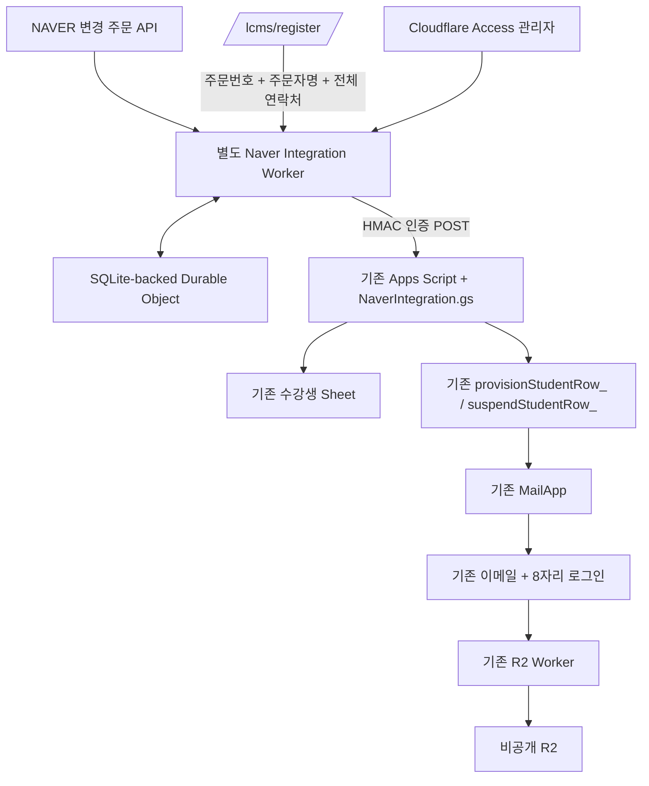

# LMC NAVER integration contract v1

기준: C0 HEAD `3b79fe35`. 구현은 기존 로그인·코드 해시·180일·MailApp·R2 Worker를 보존한다.

## 구성

단일 Durable Object를 환경별 namespace에 둔다. durable key `order:productOrderId`가 유일키이며, `exclusive`가 외부 fetch를 포함한 전체 작업을 직렬화한다. SQLite-backed storage의 atomic put을 사용한다. 이 저장소는 주문/작업 상태용이며 별도 학생 DB가 아니다. 학생 개인정보와 수강권의 canonical state는 기존 Sheets다.

## Adapter

`changes({from,to,sequence}) -> {ids,more:{from,sequence}|null}` 및 `details(ids) -> NormalizedOrder[]`. MockNaverAdapter는 같은 계약으로 테스트에 주입된다. 공개 HTTP에 mock 주문 생성 endpoint는 없다. 운영 fetch target은 `https://api.commerce.naver.com/external`로 고정한다.

| NAVER API | 계약 |
|---|---|
| POST /v1/oauth2/token | form body, bcrypt(client_id_timestamp, client_secret) → Base64; SELF 또는 SELLER/account_id |
| GET /v1/pay-order/seller/product-orders/last-changed-statuses | KST ISO, 고정 to, limitCount 300, moreFrom/moreSequence |
| POST /v1/pay-order/seller/product-orders/query | productOrderIds 최대 300, quantityClaimCompatibility true |

토큰은 메모리에만 캐시하고 expires_in으로 만료를 계산한다. 401/GW.AUTHN만 1회 갱신한다. 429/5xx/network는 최초+최대 2회 재시도, 250/500ms backoff+jitter. Retry-After가 5초를 넘으면 다음 운영 작업으로 넘긴다. 오류/권한 문제는 비밀값이나 원응답을 로그에 쓰지 않는다. 상세 누락/중복/다른 주문 응답이면 페이지 checkpoint를 진행하지 않는다.

동기화 시작시각은 운영자가 명시한 SYNC_START_AT이다. 한번에 24시간 이하의 창을 처리하며 더 오래된 미처리 주문을 매번 전체 스캔하지 않는다. 페이지 성공 후 cursor를 저장하고 장애 시 해당 페이지부터 재개한다. 완료 창은 60초 inclusive overlap을 둔다. 실행당 최대 5페이지/45초 루프 예산. 페이지 내부 I/O는 각 timeout까지 기다릴 수 있다. 취소 작업은 durable pending에 먼저 기록하므로 upstream bridge 장애에도 잃지 않는다. 재시도 5회 초과는 deadletter/수동검토로 옮겨 뒤의 작업을 막지 않는다.

## Product mapping

PRODUCT_MAPPINGS는 `{field,value,courseId}` 배열. field는 productId/originalProductId/sellerProductCode만 허용한다. courseId는 현재 과정만 허용한다. PRODUCT_MAPPING_VERIFIED=false이면 매핑하지 않는다. `13702661269`는 아직 API 실응답으로 대조되지 않았으며 설정에 자동 삽입하지 않았다. title 기반 매칭은 없다.

## 상태

NAVER status와 integration state/access/mail 상태를 각각 보관한다.

| 조건 | 상태/효과 |
|---|---|
| PAYMENT_WAITING | NAVER_DETECTED, 발급 없음 |
| 상품 불일치 | IGNORED, 발급 없음 |
| PAYED/DELIVERING/DELIVERED/PURCHASE_DECIDED | 정상 조건이면 REGISTRATION_PENDING; 기존 ACTIVE 유지 |
| 구매정보 확인 | hash-only 등록 세션, 15분 |
| 정보/동의 제출 | REGISTERED, 기존 Sheet 생성/동일 legacy row 연결 |
| 발급·메일 성공 | ACTIVE |
| 메일 오류/발급 결과 불명 | MANUAL_REVIEW, 자동 새 코드/메일 없음 |
| CANCELED/RETURNED/CANCELED_BY_NOPAYMENT | terminal tombstone; 기존 학생이 있으면 정지/세션 및 code hash 회수 |
| EXCHANGED, quantity≠1, 부분수량/클레임, 선물/마스킹, 미지 상태 | MANUAL_REVIEW |
| 관리자 정지 | SUSPENDED, 다음 PAYED로 복구 불가 |

취소는 후속 PAYED로 뒤집지 않는다. 구매확정 등 정상 후속상태도 최초 발급 이후 새 수강기간을 만들지 않는다. 수동검토 완료 버튼은 검토시각/audit만 기록하며 주문 조건이나 수강정책을 우회하지 않는다.

## 등록 보안

공식 메시지 전달수단이 운영계정에서 확인되지 않아 opaque 링크 배송을 구현하지 않았다. 고정 등록 URL에서 상품주문번호 + ordererName + 전체 ordererTel을 대조한다. 네이버 ID를 이메일로 변환하지 않는다. 이는 주문정보 대조이며 연락처 OTP 본인인증과 같지 않다.

IP HMAC 기준 10분 20회, 주문 HMAC 기준 10분 5회 검증 제한. 성공 세션은 256-bit CSPRNG, hash만 durable 저장, 15분 만료, IP hash 및 구매정보 HMAC binding. 토큰은 URL/localStorage/sessionStorage에 쓰지 않는다. 첫 등록 payload의 HMAC으로 재제출을 제한한다. 제출 직전 NAVER를 다시 조회해 취소·상품·수량·구매정보 변경을 재검증한다. 반복 제출은 동일 영수증 확인 목적이며 최초 발급을 반복하지 않는다.

API Origin은 REGISTRATION_ORIGIN 하나로 정확히 제한한다. JSON content-type/8192-byte body 제한, 사용자 입력을 HTML로 삽입하지 않는다. 브라우저에는 Apps Script URL/공유키가 전달되지 않는다.

## Apps Script API

외부 envelope: `{action,timestamp,body,signature}`. body는 JSON **문자열 원문**. signature는 `HMAC-SHA256(action + '\n' + timestamp + '\n' + body, NAVER_SHARED_SECRET)`의 unpadded Base64URL. timestamp는 5분 이내. mutation은 Apps Script 쪽 feature flags로도 차단한다. 기존 Worker/SYNC secrets와 분리한다.

| action | body | 결과 |
|---|---|---|
| naverRegister | productOrderId, courseId, naverStatus, quantity, studentName, email, phone, consent, consentVersion | state/studentId/accessStatus/mailStatus/error |
| naverOrderStatus | productOrderId, courseId | 같은 상태 계약; 자동 재발급 없음 |
| naverSuspend | productOrderId, courseId, naverStatus | 취소 tombstone 및 기존 suspend 함수 |
| naverReissue | productOrderId, courseId, operationId(UUID) | 기존 활성 기간 내 명시적 재발급 |

ScriptLock 안에서 주문번호 전수 매칭/중복검사/학생 생성/시도기록/발급을 직렬화한다. 기존 lifecycle은 내부 `lockHeld` 옵션으로 같은 lock을 사용하고, 브라우저 payload에서 이 옵션을 받지 않는다. 알려진 취소 ledger가 있으면 기존 수동 발급/재발급도 거절한다.

발급 직전에 ATTEMPTED ledger를 flush한다. 네트워크 재시도/프로세스 중단 후 같은 주문은 발급 함수를 재실행하지 않는다. MailApp에는 idempotency key와 원자적 commit이 없고 코드 원문도 저장하지 않으므로, 발송 성공 여부가 불명확한 경우 **exactly-once delivery를 주장하지 않는다**. 자동 처리는 at-most-once 발급/최초메일 시도, 불명확한 결과는 운영 검토다. 담당자가 확인한 뒤 기존 재발급을 명시적으로 실행하면 별도 UUID로 중복 클릭을 막는다. 동일 주문당 재발급 operation 영수증은 최대 100개이며 이후 자동 수락하지 않는다.

## DB/Sheet

기존 수강생 23열/세션 10열 변경 없음. 신규 `네이버연동`은 제목 1행, header 2행, data 3행부터 8열: PRODUCT_ORDER_ID, COURSE_ID, STUDENT_ID, TERMINAL_STATUS, ISSUE_ATTEMPTED, STATE, UPDATED_AT, OPERATIONS_JSON. 수강생의 CHANNEL=스마트스토어, ORDER_NO=productOrderId, PAYMENT_STATUS=확인완료.

Worker에는 stable product IDs, 주문번호, 상태, 구매시각, 불투명 학생ID, audit만 저장한다. 이름/이메일/전화/주소/raw access code는 없다. 등록 token/IP/buyer 검증값은 HMAC/hash로 만료시간과 함께 저장하고 주기적으로 삭제한다. 연락처 보유 기본값은 수강종료+30일, 미발급 신규 신청은 신청+210일. 신규 동의 버전인 행만 `purgeNaverContactData`가 연락정보를 지운다. legacy Form 행은 이 작업으로 migration/삭제하지 않는다. 주문 유일키/tombstone는 재등록 방어용으로 남으며 거래 운영정보의 보관정책은 별도 운영 문서에 명시한다.

## 관리자

`/admin` HTML/JS/CSS/API 모두 Cloudflare Access JWT의 RS256 서명, issuer, audience, exp, sub, iat, email 검증을 거친다. Cloudflare Access 정책은 운영자 계정으로 한정한다. POST는 same Origin + X-LMC-Admin:1 + JSON을 요구한다. 목록의 상품주문번호는 뒤 4자리만 표시하며 액션에는 서버 HMAC ref를 사용한다. 이름/이메일을 목록으로 복제하지 않고 opaque student ID로 Sheet에서 조회한다.

## 공식 근거

* [NAVER 인증](https://apicenter.commerce.naver.com/docs/auth)
* [변경 조회](https://apicenter.commerce.naver.com/docs/commerce-api/current/seller-get-last-changed-status-pay-order-seller), [상세 조회](https://apicenter.commerce.naver.com/docs/commerce-api/current/seller-get-product-orders-pay-order-seller)
* [공식 schema](https://apicenter.commerce.naver.com/docs/commerce-api/current/schemas/상품-주문-정보-구조체), [요청량 제한](https://apicenter.commerce.naver.com/llms/intro-제약사항.md)
* [톡톡 공식 답변](https://github.com/commerce-api-naver/commerce-api/discussions/3482), [비즈니스톡톡 안내](https://github.com/commerce-api-naver/commerce-api/discussions/1542)
* [Cloudflare SQLite-backed storage](https://developers.cloudflare.com/durable-objects/api/sqlite-storage-api/), [Access JWT](https://developers.cloudflare.com/cloudflare-one/access-controls/applications/http-apps/authorization-cookie/validating-json/)
